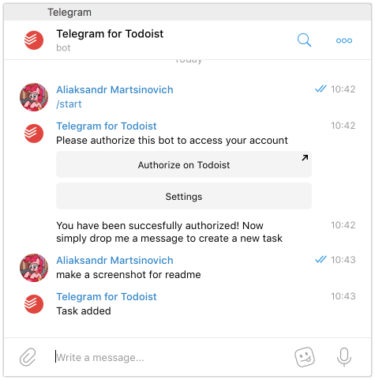

# TodoistBot

A simple Telegram bot for adding tasks in your [Todoist](https://todoist.com) inbox. It uses [Nadia](https://github.com/zhyu/nadia) for telegram bot api client and is hosted on [Google App Engine](https://cloud.google.com/appengine/)

## How it looks like



## Deployment guide


0. Clone repo, fetch deps and run tests
    ```
    mix deps.get
    MIX_ENV=test mix test
    ```
1. Setup you Google AppEngine project, install CLI, etc.
2. Create `configuration.sh` file with the following content which will store all kinds of tokens for us:
    ```
    export BOT_METRICS_TOKEN=
    export DATABASE_USERNAME=
    export DATABASE_PASSWORD=
    export DATABASE_NAME=
    export DATABASE_SOCKET_DIR="/tmp/cloudsql/DB-CONNECTION-NAME"
    export NADIA_BOT_TOKEN=
    export TODOIST_ADDRESS=
    export TODOIST_CLIENT_ID=
    export TODOIST_CLIENT_SECRET=
    ```
3. Come up with any `DATABASE_NAME` you find appropriate
4. Have a chat with [Botfather](https://core.telegram.org/bots#6-botfather) to get a bot token for `NADIA_BOT_TOKEN`
5. Consider signin up for [https://bot-metrics.com/](https://bot-metrics.com/) to get `BOT_METRICS_TOKEN`
6. `TODOIST_ADDRESS` will most probably be `https://you-appengine-project-id.appspot.com` or some custom address that you know
7. Create an app on [Todoist App Management](https://developer.todoist.com/appconsole.html) page. For this you need to provide `OAuth redirect URL`=`{TODOIST_ADDRESS}/authorization/finish` and `App service URL`=`{TODOIST_ADDRESS}/`. But you will get `TODOIST_CLIENT_ID` and `TODOIST_CLIENT_SECRET` in return
8. Create Cloud SQL instance: [Create a Cloud SQL instance](https://cloud.google.com/community/tutorials/elixir-phoenix-on-google-app-engine). During this step you will obtain `DATABASE_USERNAME`, `DATABASE_PASSWORD`, and `DB-CONNECTION-NAME`
9. Now establish a local connection to your DB using [Connect to your Cloud SQL instance](https://cloud.google.com/community/tutorials/elixir-phoenix-on-google-app-engine) part of the guide.
10. Don't forget to run `source configuration.sh` to export all environment variables.
11. Run migrations:
    ```
    mix ecto.create
    mix ecto.migrate
    ```
12. At this point you should be able to run application locally via `mix run --no-halt` command. If not you're not the curious one, just shut down sql proxy and proceed.
13. Create `app.yaml`
    ```
    cp app.yaml-example app.yaml
    ```
14. Carefully transfer all the tokens from `configuration.sh` to `app.yaml`. This file is responsible for having correct environmental variables in appengine instance.
15. Deploy!
    ```
    gcloud app deploy
    ```